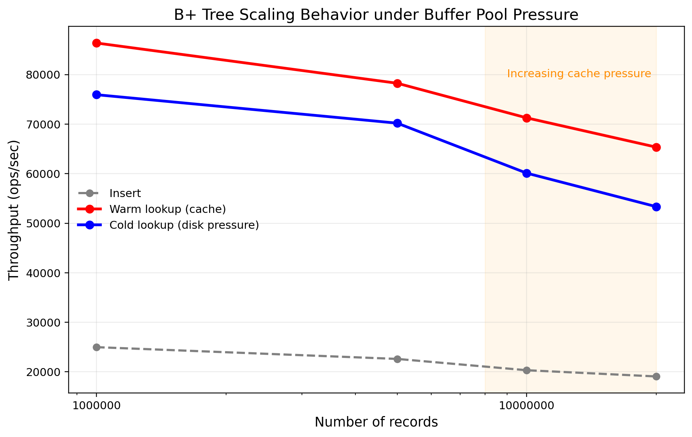

# B+ Tree over a Block File Layer

A B+ tree index file implementation in C, built on top of a low-level Block File (BF) memory management layer.

---

## Overview

Each tree node maps directly to a block managed by the BF layer. Since blocks are managed by a buffer pool and may be evicted under its replacement policy, child pointers are stored as **block IDs** (file positions) rather than in-memory pointers.

The tree supports:

* **Data nodes (leaves):** store `Record` entries and are linked via sibling pointers for efficient range traversal
* **Index nodes (internal):** store `(child_block_id | key | child_block_id | ... | child_block_id)` routing entries
* **Recursive insert** with bottom-up key propagation and node splitting
* **Recursive search** down to the appropriate leaf node

---

## Structure

```
Block 0         metadata (BPLUS_INFO: tree height, root id, capacities)
Block 1..n      data nodes or index nodes
```

---

## Key structs

```c
typedef struct {
    int height;           // -1: empty tree, 0: root is leaf, >0: index levels exist
    size_t rec_size;
    int data_capacity;
    int index_capacity;
    int root;
} BPLUS_INFO;

typedef struct {
    int rec_count;
    int sibling;          // right sibling block id (-1 if none)
} BPLUS_DATA_NODE;

typedef struct {
    int rec_count;
} BPLUS_INDEX_NODE;
```

> Note: node metadata is stored at the end of each block.

---

## API

| Function                             | Description                                                    |
| ------------------------------------ | -------------------------------------------------------------- |
| `BP_CreateFile(fileName)`            | Creates a new B+ tree file                                     |
| `BP_OpenFile(fileName, &fd)`         | Opens file and loads metadata into heap-allocated `BPLUS_INFO` |
| `BP_CloseFile(fd, info)`             | Flushes metadata to disk, frees `info`, closes file            |
| `BP_InsertEntry(fd, info, record)`   | Inserts a record; handles node splits and root promotion       |
| `BP_GetEntry(fd, info, id, &record)` | Searches for a record by key                                   |

`BP_InsertEntry` returns `-1` if a duplicate key is detected.

---

## Splits

### Data node split

When a leaf overflows:

* The node is split into two halves
* The right half is moved into a new block
* The smallest key of the new block is promoted to the parent
* Leaf sibling pointers are updated to maintain linked order

### Index node split

When an internal node overflows:

* The middle key is **promoted to the parent**
* Left and right partitions are separated into two index blocks
* The promoted key is removed from the original node

If the root splits, a new root is created and tree height increases.

---

## Benchmarks

Measured throughput (ops/sec) under increasing dataset sizes. Lookups were tested under two conditions:

* **Warm:** buffer pool contains relevant blocks
* **Cold:** buffer pool flushed, forcing block reads



| Records    | Insert | Warm Lookup | Cold Lookup |
| ---------- | ------ | ----------- | ----------- |
| 1,000,000  | 24,983 | 86,361      | 75,930      |
| 5,000,000  | 22,610 | 78,244      | 70,189      |
| 10,000,000 | 20,328 | 71,254      | 60,096      |
| 20,000,000 | 19,074 | 65,345      | 53,336      |

Insert throughput degrades gradually as tree height increases and buffer pressure grows. Warm lookups remain consistently faster than cold lookups, with the gap widening at larger dataset sizes once the working set exceeds buffer capacity.

---

## Build & Run

Requires the `bf` library in `./lib/` and headers in `./include/`.

```bash
make            # build + run tests and benchmarks
make test       # run tests only
make benchmark  # run benchmarks only
make clean      # remove artifacts and database files
```

---

## Notes

* Tree order below 2 is not supported
* Blocks are pinned during traversal and unpinned after use according to buffer manager semantics
* Range queries use leaf sibling pointers and do not traverse index nodes
* `PrintRecsOrdered` performs an in-order scan via leaf-level linked traversal

---
